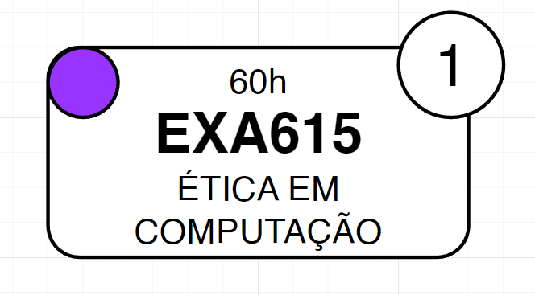

<p align="center">

</p>

<h2 align="center">Universidade Estadual de feira de Santana - UEFS</h2>
<h1 align="center">Árvore de dependências do curso de Bacharelado em Engenharia da Computação</h1>

```
Olá! Essa é a árvore de dependências do curso de ECOMP. Nela é mostrado a relação entre as 55 matérias necessárias para obter a formação completa como bacharel em Engenharia da Computação pela Universidade Estadual de Feira de Santana. Você pode se guiar com ela para conseguir um aproveitamento melhor das matérias durante o curso.

A documentação abaixo explica como a árvore deve ser lida, como você pode contribuir no projeto e como conseguir uma cópia a ser impressa caso prefira.
```

### Resolução 124/2020


## Como ler a árvore

### Matérias



A árvore é composta pelas matérias da grade curricular de ECOMP. Cada matéria é representada por um card de bordas arredondadas com as informações da matéria.
Nela consta:

- Carga horária da matéria (ex.: 60h)
- Código da matéria (ex.: EXA890)
- Nome da matéria (ex.: Ética em Computação)
- Código de cor do semestre (explicação abaixo)
- Score da matéria (explicação abaixo)

### Regras da árvore

- Os componentes mais ao topo, sem nenhuma seta anterior, não tem pré-requisitos.

- Uma matéria com algum requisito tem a matéria que é requisito apontando uma seta para ela (ex.: A matéria de `Cálculo D e I 1` tem como dependência `Introdução ao Cálculo`, por isso `Introdução ao Cálculo` → `Cálculo D e I 1` ).

- As setas vermelhas são usadas só para melhor visualização quando há cruzamento de setas.

- Algumas matérias especiais precisam de uma porcentagem da grade para estar disponível. É possível ver elas ao canto superior direito da árvore como uma nota vermelha as instruções necessárias para desbloquear cada.

- As matérias optativas estão em branco permitindo quem imprimir usar o espaço como quiser.

### Esquema de cores dos semestres

O esquema de cores, como já dito, é mostrado no card da matéria


## Pontuação das matérias

Cada matéria apresenta um score no canto superior direito, qual vai dizer o impacto que ela tem nas matérias futuras.
Uma matéria, por exemplo, que não tenha nenhuma outra que dependa dela fica com o score 1


Já uma matéria que tenha quem dependa dela vai constar como a somatória de quantas matérias ela vai impactar + 1 que seria da própria matéria


> Uma matéria de pontuação 1 por exemplo não necessariamente significa que não é uma matéria importante. Lembre-se que você precisa de todas as matérias para formar.

## Como contribuir nesse projeto

- Faça um fork do repositório
- Crie uma branch contendo a modificação que você quer fazer

### Contribuindo na árvore

- Abra o projeto na pasta `src/dependency_tree.drawio` no site [Draw.io](https://app.diagrams.net/) com o o seu fork do projeto na pasta. Você precisa logar com sua conta do github no site e clicar em "Abrir diagrama existente"
- Faça as modificações e commite
- Faça um pull request

### Contribuindo na documentação

- Clone o repositório em sua máquina, faça suas modificações e peça um pull request

> Você também pode abrir uma issue relatando um erro ou dando alguma sugestão

## Como fazer a impressão da árvore

Você pode abrir o projeto no draw.io e fazer a impressão por lá

Também está sendo disponibilizada o pdf da árvore na pasta `src/dependency_tree.pdf`

## Como fazer modificações personalizadas

- Siga os passos para contribuição na árvore
- Seja criativo e ajuste como quiser 😉

## Contributors

<!-- ALL-CONTRIBUTORS-LIST:START - Do not remove or modify this section -->
<!-- prettier-ignore-start -->
<!-- markdownlint-disable -->

<!-- markdownlint-restore -->
<!-- prettier-ignore-end -->

<!-- ALL-CONTRIBUTORS-LIST:END -->
